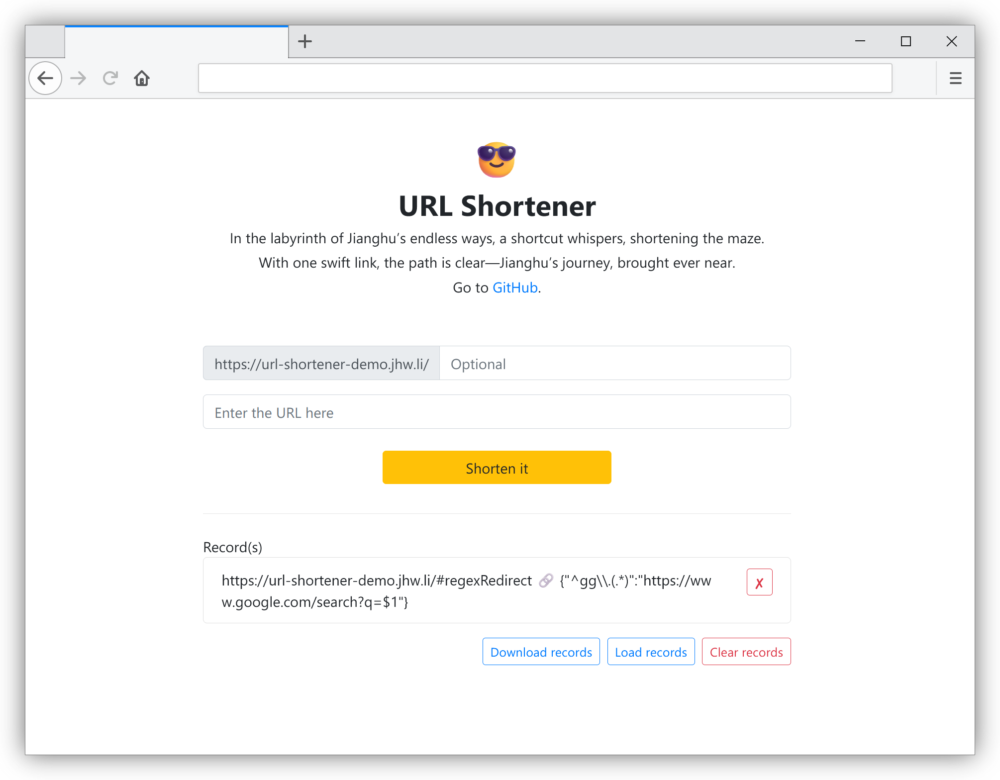

# URL Shortener

[English](../README.md) | 简体中文



这是一个基于 CloudFlare Worker 部署的链接缩短器，无需服务器轻松部署，可绑定自定义域名。

本分支功能特性：

- 支持 CloudFlare Worker 环境变量配置参数。
- 支持权限分级，可设置管理员与访客密码（访问路径），可对访客设置权限限制。
- 支持对未授权用户、访客用户及管理员用户设置不同的主页。
- 支持配置正则表达式规则。
- 可在网页中缓存并管理生成的记录。@crazypeace
- 可下载全部生成的记录并缓存到本地。@crazypeace
- PWA 特性支持。
- 其他细节改进。

*部分功能合并自 [@crazypeace](https://github.com/crazypeace/Url-Shorten-Worker) 的分支。

## 使用

### 网页使用

Demo 地址：[url-shortner-demo.iou.icu](https://url-shortner-demo.iou.icu/)

注意：Demo 仅供试用，有额外的限制规则并且会定时删除记录。请自行部署来使用。

### API

[API文档](API_zh-hans.md)

## 部署

通过 Cloudflare 部署，如果你的域名托管在 Cloudflare 则可以绑定你的域名。

### 创建 KV

创建一个 KV Namespace。


### 部署 Worker

创建一个 Worker。

去 Worker => Worker 名字 => Variables => KV Namespace Bindings 。


其中 Variable name 填写 `LINKS`,  KV namespace 填写你刚刚创建的命名空间。


点击 `Edit Code`，复制本项目中的 `index.js` 的代码到 Cloudflare Worker 。

点击 Deploy。

### 绑定域名

去 Worker => Worker 名字 => Triggers => Routes 来绑定你自己的域名来访问。

### 环境变量

去 Worker => Worker 名字 => Variables => Environment Variables 来配置环境变量。

| 变量名称       | 值（默认）                | 说明                                                         |
| -------------- | ------------------------- | ------------------------------------------------------------ |
| REPO_VERSION   | @gh-pages                 | 前端页面仓库版本，如果使用 Jsdelivr CDN 地址则可能需要改为 Release tag，否则可能不是最新版本 |
| PASSWORD_ADMIN | admin                     | 管理员用户密码（访问路径），值为空表示无管理员用户           |
| PASSWORD       |                           | 访客用户密码（访问路径），值为空表示主页                     |
| INDEX_REDIRECT |                           | 访客用户密码值不为空时，主页跳转的 URL                       |
| URL_EXCLUDE    | //url-shortner-demo.iou.icu | 排除本机域名，请修改为你的域名                               |
| THEME_ADMIN    |                           | 管理员用户主页路径，如：`theme/admin`                        |
| THEME          |                           | 访客用户主页                                                 |
| LEN            | 6                          | 随机生成的短链路径长度                                       |
| NO_REF         | false                     | 控制 HTTP referrer header                                    |
| CORS           | false                     | 允许 API 请求提供跨源资源共享                                |
| UNIQUE_LINK    | false                     | 为相同的 URL 生成相同的短链                                  |
| CUSTOM_LINK    | true                      | 允许访客用户自定义短链                                       |
| LEN_LIMIT      | 3                         | 允许访客用户自定义短链的最小长度                             |
| REGEX_REDIRECT | false                     | 开启正则表达式重定向功能                                     |

### 正则表达式重定向

启用正则表达式重定向功能请先将环境变量 `EGEX_REDIRECT` 设置为 `true`。

正则表达式以 `json` 的格式存储在 KV `#regexRedirect` 键中，像这样：

```
Key = #regexRedirect
Value = {"^(example.*)": "https://www.iou.icu/$1","^gg\\.(.*)":"https://www.google.com/search?q=$1"}
```
在运行时会被转为字典，字典的键为正则表达式匹配规则，值为替换规则。

这条记录代表着有两条正则规则：

>**规则一**
>
>查找：`^(example.*)`
>
>替换：`https://www.iou.icu/$1`

>**规则二**
>
>查找：`^gg\.(.*)`
>
>替换：`https://www.google.com/search?q=$1`

传入的短链接会依次匹配，应用第一个匹配的规则。

例如传入短链接 `https://example.com/example-apple`，重定向结果为 `https://www.iou.icu/example-apple` 。

如果是 `https://example.com/gg.apple` ，将跳转 ``https://www.google.com/search?q=apple``。你会得到一个快捷搜索。

正则表达式优先于短链接，请确保 `json` 格式正确并做好转义。
